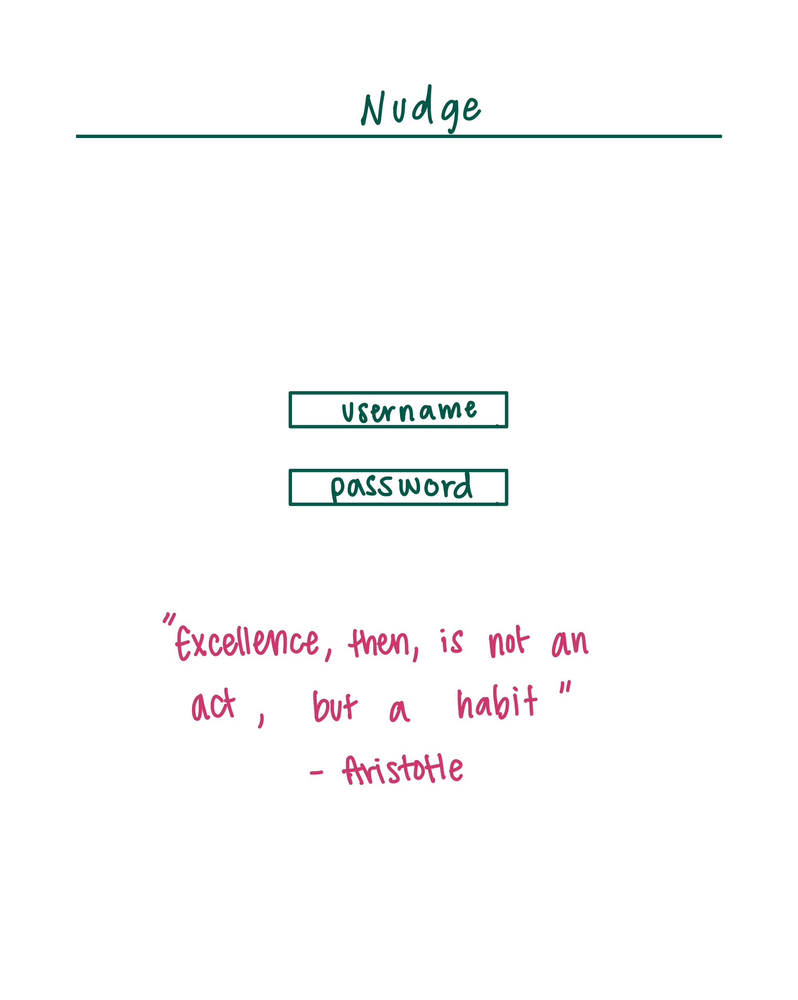
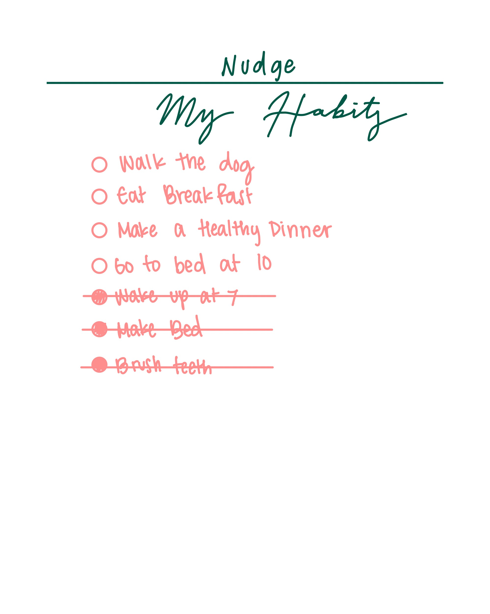
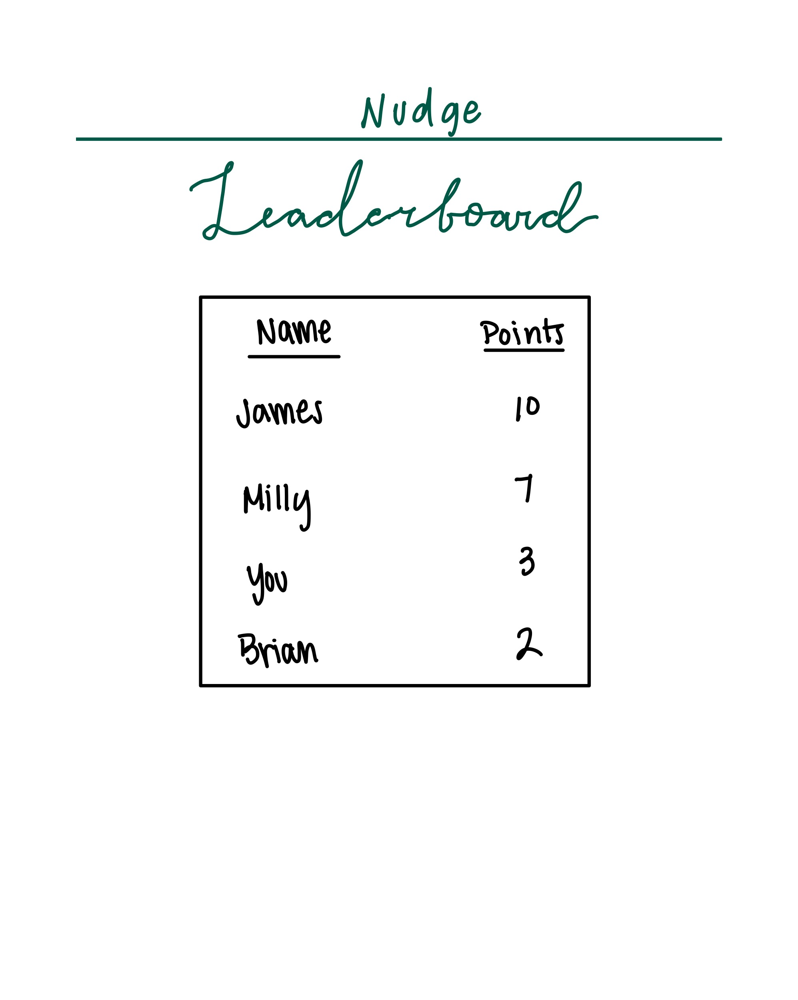
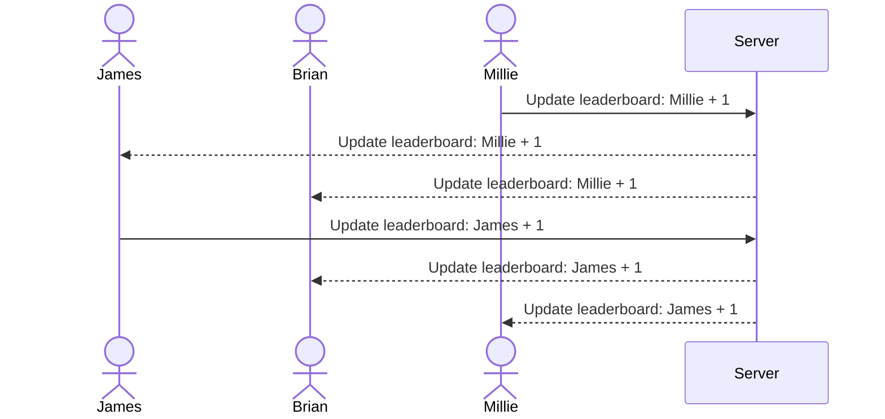

# Nudge

[My Notes](notes.md)

This application's purpose is to aid people in sticking to their goals of creating habits. It will allow a user to create new daily, weekly, and monthly tasks which they can keep track of and check off. They will also be able to check in on their friends progress with a friend leaderboard which provides an accoutablility aspect to the application.

## 🚀 Specification Deliverable

> [!NOTE]
>  Fill in this sections as the submission artifact for this deliverable. You can refer to this [example](https://github.com/webprogramming260/startup-example/blob/main/README.md) for inspiration.

For this deliverable I did the following. I checked the box `[x]` and added a description for things I completed.

- [x] Proper use of Markdown
- [x] A concise and compelling elevator pitch
- [x] Description of key features
- [x] Description of how you will use each technology
- [x] One or more rough sketches of your application. Images must be embedded in this file using Markdown image references.

### Elevator pitch

Happy New Year! Time to pull out your trusty notes app and write down all the resolutions, goals and things you hope to do this year, but never actually manage to keep doing past the month of February right? ***Wrong!*** Nudge is a new habit tracking app that helps you build consistency in any new habits you want to form. Start whenever, wherever and build the habits you've always been trying to. You can also have accountability buddies when you share the app with your friends and compete for the highest score on your personal leaderboard.

### Design

The leaderboard stays up-to-date in real time using **WebSockets**.

### Key features

- Secure login over HTTPS
- Ability to create new habits to track
- Display of all incomplete habits
- Display of all completed habits ~~struck through~~
- Leaderboard from all users displayed in realtime
- Ability for a user to check off habits when completed
- Daily Scores persistently stored
- Ability to delete old habits

### Technologies

I am going to use the required technologies in the following ways.

- **HTML** - Uses correct HTML structure for application. Three HTML pages. One for login and one for habit tracking and one for websocket updated leaderboard.
- **CSS** - Application styling that looks good on desktop and mobile. Includes progress bars and uses consistent color palettes, whitespace, and contrast.
- **React** - Provides components for login/register, habit list, habit creation form, and leaderboard. Handles routing between login, dashboard, and history views. Updates UI dynamically when habits are added, completed, or deleted.
- **Service** - Backend service with endpoints for:
    - login, register, logout
    - creating, retrieving, updating, and deleting habits
    - checking off habits as complete
    - retrieving user history and daily scores
- **DB/Login** - Store users, habits, and daily check-ins in the database. Securely hash and store credentials. Enforce authentication so habits can only be managed by the logged-in user. Persist daily scores across sessions.
- **WebSocket** - Broadcasts real-time updates when users check off habits. Updates a live leaderboard showing current scores of all users.

## 🚀 AWS deliverable

For this deliverable I did the following. I checked the box `[x]` and added a description for things I completed.

- [x] **Server deployed and accessible with custom domain name** - [My server link](https://ndge.click).

## 🚀 HTML deliverable

For this deliverable I did the following. I checked the box `[x]` and added a description for things I completed.

- [x] **HTML pages** - Three different pages. One for each view. `index.html` (Login), `track.html`, and `leaderboard.html`.
- [x] **Proper HTML element usage** - I used header, footer, main, nav, img, a and many more.
- [x] **Links** - Links between views.
- [x] **Text** - Index page has text.
- [x] **3rd party API placeholder** - Track page has a place to display an inspirational quote.
- [x] **Images** - Image is displayed on the index page.
- [x] **Login placeholder** - Placeholder for auth on the login page.
- [x] **DB data placeholder** - High scores displayed on scores page.
- [x] **WebSocket placeholder** - The leaderboard page has a text area that will show updated leaderboard.

## 🚀 CSS deliverable

For this deliverable I did the following. I checked the box `[x]` and added a description for things I completed.

- [x] **Header, footer, and main content body** - Header, footer, and main structure are implemented.
- [x] **Navigation elements** - Navigation menu with links to Home, Track, and Leaderboard is implemented and styled.
- [x] **Responsive to window resizing** - Basic responsive layout applied via CSS media queries.
- [x] **Application elements** - Leaderboard table and realtime section implemented as main app elements.
- [x] **Application text content** - Names, points, and placeholder text added.
- [x] **Application images** - Image added for this deliverable

## 🚀 React part 1: Routing deliverable

For this deliverable I did the following. I checked the box `[x]` and added a description for things I completed.

- [x] **Bundled using Vite** - I completed this part of the deliverable.
- [x] **Components** - I completed this part of the deliverable.
- [x] **Router** - I added a router in my app.jsx file.

## 🚀 React part 2: Reactivity deliverable

For this deliverable I did the following. I checked the box `[x]` and added a description for things I completed.

- [x] **All functionality implemented or mocked out** - I implemented all main functionality using React components (Login, Track, Leaderboard) and mocked out future features such as a motivational quote API using setTimeout.
- [x] **Hooks** - I used useState to manage component state (e.g., habits, login inputs) and useEffect to handle lifecycle events like fetching a motivational quote.

## 🚀 Service Deliverable

For this deliverable I did the following. I checked the box `[x]` and added a description for things I completed.

- [x] **Node.js/Express HTTP service** – Implemented a full Express backend to handle authentication, habit management, and score tracking.
- [x] **Static middleware for frontend** – Configured Express to serve the React frontend with static middleware.
- [x] **Calls to third party endpoints** – I implemented a 3rd party inspirational quote which updates on the login page.
- [x] **Backend service endpoints** – Added RESTful routes for `/register`, `/login`, `/logout`, `/habit`, and `/score` to manage user data and leaderboard functionality.
- [x] **Frontend calls service endpoints** – Integrated frontend fetch requests for registration, login/logout, adding/deleting habits, and updating scores.
- [x] **Supports registration, login, logout, and restricted endpoint** – Implemented user authentication using cookies and tokens, ensuring access control for habit and score routes.

## 🚀 DB deliverable

For this deliverable I did the following. I checked the box `[x]` and added a description for things I completed.

- [x] **Stores data in MongoDB** - Scores and users stored in MongoDB from `service/database.js`
- [x] **Stores credentials in MongoDB** - Auth stored in MongoDB from `service/database.js`.

## 🚀 WebSocket deliverable

For this deliverable I did the following. I checked the box `[x]` and added a description for things I completed.

- [ ] **Backend listens for WebSocket connection** - I did not complete this part of the deliverable.
- [ ] **Frontend makes WebSocket connection** - I did not complete this part of the deliverable.
- [ ] **Data sent over WebSocket connection** - I did not complete this part of the deliverable.
- [ ] **WebSocket data displayed** - I did not complete this part of the deliverable.
- [ ] **Application is fully functional** - I did not complete this part of the deliverable.
